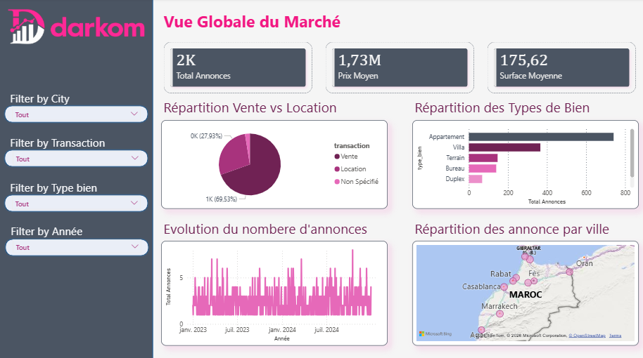
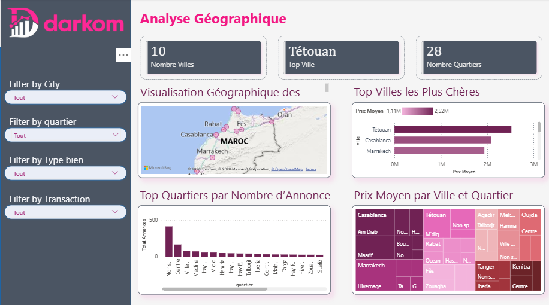
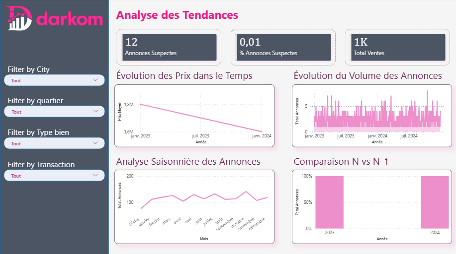

<div align="center">


<h1 align="center">

<span style="color:#E75480;">DARKOM</span>
<span style="color:white;"> REAL ESTATE ANALYTICS</span>

</h1>

<div align="center">


</div>

<br>

<a href="https://git.io/typing-svg">

</a>

<br><br>

<p align="center">
A modern Business Intelligence platform designed to transform raw Moroccan real estate data into actionable business insights through advanced SQL processing, dimensional modeling and interactive Power BI dashboards.
</p>

<br>


</div>

<br><br>

<div align="left">


</div>

<br>

This project delivers a complete Business Intelligence workflow dedicated to the Moroccan real estate market.

Starting from raw CSV advertisements data, the solution performs:

- SQL data cleaning
- Data transformation
- Feature engineering
- Dimensional modeling
- Warehouse optimization
- Interactive visualization

The final result is a scalable analytical platform optimized for Power BI and business decision-making.

<br><br>

<div align="left">


</div>

<br>

<div align="center">

```text
Raw CSV Dataset
        ↓
Staging Layer
        ↓
Data Cleaning & Validation
        ↓
Feature Engineering
        ↓
Star Schema Data Warehouse
        ↓
Power BI Semantic Model
        ↓
Interactive Dashboards & KPIs
```

</div>

<br><br>

<div align="left">


</div>

<br>

<div align="center">

```text
                dim_date
                    |
                    |
dim_localisation -- fact_annonces -- dim_bien
```

</div>

<br>

The project uses a professional Star Schema architecture optimized for:

- High-performance analytics
- Fast aggregations
- Power BI optimization
- Scalable reporting
- Simplified business queries

<br><br>

<div align="left">


</div>

<br>

<details>
<summary><b style="color:#ff7aa2;">Expand Repository Structure</b></summary>

<br>

```text
darkom-real-estate-datawarehouse-bi/
│
├── data/
│   └── raw/
│       └── darkom_annonces.csv
│
├── logs/
│   ├── cleaning_logs.txt
│   └── import_logs.txt
│
├── powerbi/
│   ├── darkom_dashboard.pbix
│   ├── dax_measures.txt
│   └── screenshots/
│       ├── Vue_global_du_marche.png
│       ├── analyse_les_prix.png
│       ├── analyse_geographie.png
│       └── analyse_tendance.png
│
├── sql/
│   ├── staging/
│   ├── cleaning/
│   ├── warehouse/
│   └── validation/
│
└── README.md
```

</details>

<br><br>

<div align="left">


</div>

<br>

<div align="center">

| Technology | Purpose |
|---|---|
| PostgreSQL | Database & Data Warehouse |
| SQL | ETL & Data Processing |
| Power BI | Dashboards & Visualization |
| Power Query | Data Modeling |
| DAX | Business KPIs & Measures |
| Git & GitHub | Version Control |

</div>

<br><br>

<div align="center">


</div>

<br><br>

<div align="left">


</div>

<br>

<div align="left">


</div>

<br>

The raw dataset is first loaded into a staging schema for temporary storage and validation.

### Operations:
- CSV import
- Integrity verification
- Logging
- Temporary storage management

<br>

<div align="left">


</div>

<br>

Several SQL scripts were developed to clean and standardize the dataset.

### Cleaning Tasks:
- Duplicate removal
- Missing values handling
- City standardization
- Encoding correction
- Outlier analysis
- Type conversion
- Validation checks

<br>

<div align="left">


</div>

<br>

| Feature | Description |
|---|---|
| prix_m2 | Price per square meter |
| age_bien | Estimated property age |
| categorie_prix | Price segmentation |
| categorie_surface | Surface segmentation |
| annee_publication | Publication year |
| mois_publication | Publication month |
| trimestre_publication | Publication quarter |

<br><br>

<div align="left">


</div>

<br>

<div align="center">

<table>
<tr>
<td width="50%">

<div align="left">


</div>

### KPIs
- Total advertisements
- Average market price
- Average surface
- Average price per m²

### Analytics
- Sales vs Rentals
- Property type distribution
- Geographic distribution
- Market evolution

</td>

<td width="50%">



</td>
</tr>
</table>

</div>

<br><br>

<div align="center">

<table>
<tr>
<td width="50%">

<div align="left">


</div>

### KPIs
- Average price
- Maximum price
- Average price per m²

### Analytics
- Price distribution
- City comparison
- Segment analysis
- Property comparison

</td>

<td width="50%">


</td>
</tr>
</table>

</div>

<br><br>

<div align="center">

<table>
<tr>
<td width="50%">

<div align="left">


</div>

### KPIs
- Number of cities
- Number of neighborhoods
- Most active locations

### Analytics
- Geographic visualization
- Most expensive cities
- Neighborhood ranking
- Spatial price analysis

</td>

<td width="50%">



</td>
</tr>
</table>

</div>

<br><br>

<div align="center">

<table>
<tr>
<td width="50%">

<div align="left">


</div>

### KPIs
- Growth rate
- Market evolution
- Sales trends

### Analytics
- Time series analysis
- Seasonal analysis
- N vs N-1 comparison
- Advertisement evolution

</td>

<td width="50%">



</td>
</tr>
</table>

</div>

<br><br>

<div align="left">


</div>

<br>

```DAX
Total Annonces
Prix Moyen
Prix Moyen m²
Surface Moyenne
Total Ventes
Total Locations
Croissance Annonces %
Age Moyen Bien
Prix Maximum
Prix Minimum
Annonces Suspectes
```

<br><br>

<div align="left">


</div>

<br>

- Casablanca and Marrakech dominate the market volume.
- Villas represent the highest-value property segment.
- Rental prices remain significantly lower than sales prices.
- Seasonal variations impact advertisement activity.
- Price-per-square-meter analysis helped detect suspicious records.

<br><br>

<div align="center">


</div>
